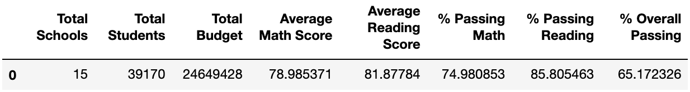
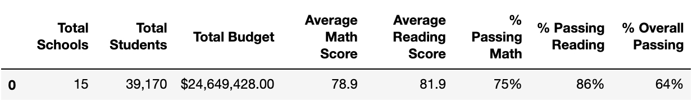
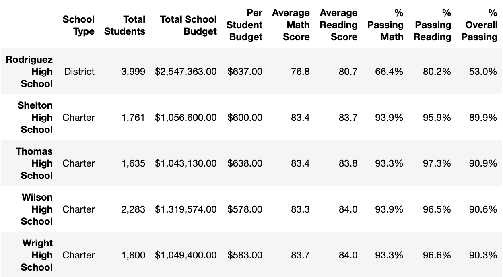
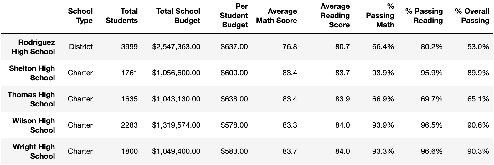
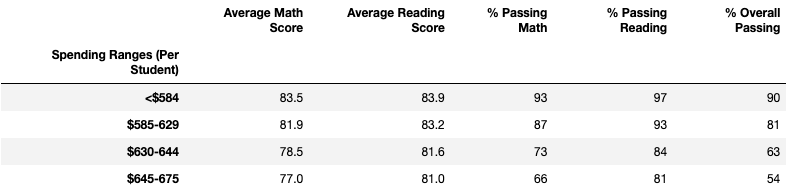

# School District Analysis

## Overview of School District Analysis
A hypothetical data scientist for a city school district, Maria,  asked for assistance in analyzing standard test data from various schools.  The analysis, which was based on math and reading scores, school type, current funding and size of each school, was to be used by the school board to plan budget allotments.  A possible error has occured with the individual student data for ninth graders at Thomas High School.  Their test scores may have been altered dishonestly.  In order to uphold state-testing standards, they need to be replaced with NaN.  The goal of this report is to analyze the effect these changes may  have had on the previous analysis.

## School District Analysis Results
<ul>
  <li> <b>Is the district summary affected?</b>
    <ul>
      <li> The original district summary was as follows:
        

            
        

      </li>
      <li> And the  district summary with 9th grade test scores as NaN was:
        

            
        

      </li>
      <li> As you can see, there are only 2 minor changes:
        <ul>
          <li> Overall passing percent reduce from 65% to 64%. </li>
          <li> The average math score reduced from 79.0 to 78.9. </li>
        </ul>
      </li>
      <li>  Although this change is rather miniscule, there is a total of 39,170 students in the district, and there are only 461 freshman in Thomas High School.  This implies that the effect the changed results have on the overall statistics must be small. </li>
    </ul>
  </li>
  <li><b> Is the school summary affected? </b>
    <ul>
      <li> This is part of the original school summary including Thomas High School:
        

            
        

      </li>
      <li> When 9th grade scores were changed to NaN, the results changed drastically for the idividual school:
        

            
        

      </li>
      <li> As you can see, there are 3 major changes and 1 minor change:
        <ul>
          <li> Overall passing reduced from 90.9% to 65.1%.</li>
          <li> The percent of students passing math reduced from 93.3% to 66.9%. </li>
          <li> The percent of students passing reading reduced from 97.3% to 69.7%. </li>
          <li> The average math score increased from 83.8 to 83.9. </li>
        </ul>
      </li>
      <li> The reason the percentages have changed so much is because NaN count as not passing. Since the school only has 1,635 students, 461 of whick are freshman, it's understandable what this woulkd have such a drastic impact.  However, the average math score has actually gone up.  It seems that NaN don't get included in the total count for the mean() function, so the fact that the average score went up, even slightly, may imply that the freshamn had a lower average math score thent he rest of the school. In doesn't seem logical, however to use these percentages to signify the school scores, so the scores of the percentages for passing were recalculated only including 10th, 11th and 12th graders.
        

            
        

      </li>
      <li> There are 4 minor changes compared to the original school summary:
        <ul>
          <li> Overall passing reduced from 90.9% to 90.6%.</li>
          <li> The percent of students passing math reduced from 93.3% to 93.2%. </li>
          <li> The percent of students passing reading reduced from 97.3% to 97.0%. </li>
          <li> The average math score increased from 83.8 to 83.9 just like it did for the initial recalculation. </li>
        </ul>
      </li>
      <li> This definitely made the percents more reasonable.  Evenb so, we still see that they definiteyl reduced, even slightly.  This would imply that the portion of students with passing grades is higher was higher in the freshman class then in the rest of the grades.
      </li>
    </ul>
  </li>
   <li><b> Does replacing the ninth graders' math and readign scores affect Thomas high School's performance relative to other schools?</b>
    <ul>
      <li> These were the original top 5 schools in the district:
        

            
        

      </li>
      <li> This is the order of the top 5 after reculculations:
        

            
        

      </li>
      <li>As you can see, Thomas High School has not lost its position of #2 school on the list. </li>
    </ul>
  </li>
  <li><b> Does replacing the ninth-grade scores affect math and reading scores by grade? </b>
    <ul>
      <li> These are the math scores with original on the left and updated on the right:
        

          &nbsp&nbsp&nbsp&nbsp&nbsp&nbsp&nbsp&nbsp&nbsp&nbsp  
        

      </li> 
      <li>These are the reading scores with original on the left and updated on the right:
        &nbsp&nbsp&nbsp&nbsp&nbsp&nbsp&nbsp&nbsp&nbsp&nbsp  
      </li>
      <li> Since the score averages are by grade for each school, we shouldn't expect to see anyhting different between the original and the updated version other than obviously the nan in 9th grade for Thomas High School.  
      </li>
    </ul>
  </li>
  <li><b>Does replacing the ninth-grade scores affect scores by school spending?</b>
    <ul>
      <li>This is the original spending range dataframe:
        

            
           <figcaption> Spending range is calculated by take the budget for the school and diving it by the number of students.</figcaption>
        

      </li>
      <li> This the updated spending range dataframe:
        

           
        

      </li>
      <li>  There is no difference between the two dataframes.  It is important to note a strong correlation between the budget per person and the passing rate.  It's unexpected, but appears that the less cost per student, the higher the passing rate.
      </li>
    </ul>
  </li>
  <li><b>Does replacing the ninth-grade scores affect scores by school size?</b>
    <ul>
      <li> This is the original scores based on size dataframe:
        

            
           <figcaption> Spending range is calculated by take the budget for the school and diving it by the number of students.</figcaption>
        

      </li> This is the updated scores by size dataframe:
        

           
        

      <li> Again, no difference between the 2 dataframes.  Thomas High School has 1,635 students.  If there was going to be a differece, it's safe to assume it would be in the medium row.  There is an obvious correlation between size and passing percentage.  Increasing from the medium tot he large greatly reduces the passing percentage.
      </li>
    </ul>
  </li>
  <li><b>Does replacing the ninth-grade scores affects scores by school type?</b>
    <ul>
      <li> This is the original scores by school type dataframe:
        

            
           <figcaption> Spending range is calculated by take the budget for the school and diving it by the number of students.</figcaption>
        

      </li>
      <li>This is the updated scores by type dataframe:
        

           
        

      </li>
      <li> Again, no change between the 2 dataframes.  Thomas High School is a Charter school so if there was a change it would be in that row.  
      </li>
    </ul>
  </li>
</ul>
  
## School District Analysis Summary
Considering this is such a large sample, it makes sense that there weren't many changes other than for the individual school.  The overall passing percent, the percent passing math, the percent passing reading and the average math score for Thomas High School were the only changes that occured.  Since the percents decreased slightly for the school without the ninth graders, it seems like the possible dishonest grades may have ended up maing the school look slightly better, but definitely not much. 
The overall passing percent did reduce by 1% in the district summary but since that was calculated before the scores were averaged for Thomas High based on 10th, 11th and 12th grade,  it appears that must be where the discrepancy comes from.  Only the statistics for Thomas High School were affected by this change.
